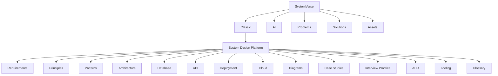

# 🌌 SystemVerse

**The Universe of Classic & AI System Design**

SystemVerse is your all-in-one hub for mastering both traditional and AI-driven system design. Whether you’re prepping for interviews, architecting production systems, or exploring the latest in LLMs and agent-based architectures, SystemVerse brings clarity, depth, and hands-on resources together.

---

## 🧭 One-Click Navigation (Features & Sub-Features)

<strong>� Classic System Design</strong>

- [Classic Platform Home](classic/system-design-platform/README.md)
- [Requirements](classic/system-design-platform/requirements.md)
- [Principles](classic/system-design-platform/principles.md)
- [Design Patterns](classic/system-design-platform/patterns.md)
- [Architecture](classic/system-design-platform/architecture.md)
- [Database](classic/system-design-platform/database.md)
- [API](classic/system-design-platform/api.md)
- [Deployment](classic/system-design-platform/deployment.md)
- [Cloud](classic/system-design-platform/cloud.md)
- [Diagrams](classic/system-design-platform/diagrams.md)
- [Case Studies](classic/system-design-platform/case-studies/README.md)
- [Interview Practice](classic/system-design-platform/interview-practice/README.md)
- [ADR](classic/system-design-platform/adr/README.md)
- [Tooling](classic/system-design-platform/tooling/README.md)
- [Glossary](classic/system-design-platform/glossary.md)

<strong>🤖 AI System Design</strong>

- (Coming soon) LLMs, agent orchestration, vector DBs, prompt engineering, RAG, AI patterns

<strong>📝 Problems & Solutions</strong>

- [Problem Template](problems/problem-template.md)
- [Solution Template](solutions/solution-template.md)
- (Add your own: tag as Classic or AI)

<strong>🖼️ Visuals & Assets</strong>

- [SystemVerse Structure Diagram](assets/systemverse-structure.png)

---

## 🗂️ Visual Project Hierarchy

---

## 📚 Free & Open Resources

- [The System Design Primer (GitHub)](https://github.com/donnemartin/system-design-primer)
- [Google Site Reliability Engineering Book](https://sre.google/books/)
- [Awesome Scalability](https://github.com/binhnguyennus/awesome-scalability)
- [Martin Fowler’s Architecture Patterns](https://martinfowler.com/architecture/)

For more, see the references in each section file.

---

This project is maintained by experienced architects and welcomes contributions. See `classic/system-design-platform/CONTRIBUTING.md` for details.

## 🛣️ Roadmap

- [ ] Interactive diagrams and visual tools
- [ ] Real-world case studies and AI architectures
- [ ] Web UI for browsing, search, and visualization
- [ ] Community Q&A and discussion

---

## 📜 License

MIT License © 2025 VenkataAnilKumar
