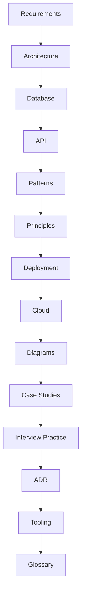
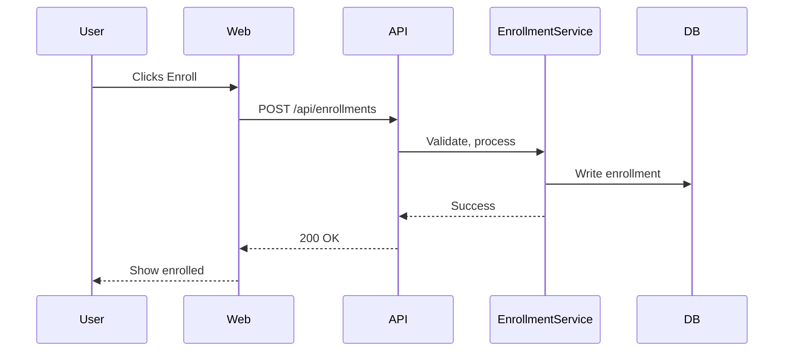

# SystemVerse Classic


Welcome to the **Classic** section of SystemVerse! This is your comprehensive, open, and modular resource for mastering system design fundamentals, principles, and real-world case studies.


## Overview

**Folders:**
- `system-design-platform/`: Modern system design theory, architecture, patterns, databases, APIs, deployment, cloud, diagrams, 20+ real-world case studies, interview prep, ADRs, tooling, and glossary.
- `object-oriented-design/`: Object-Oriented Analysis & Design, UML, 15+ classic case studies, Python code, and diagrams.


SystemVerse Classic is organized into two major parts:

- **System Design Platform**: Everything you need to master modern system design—requirements, architecture, patterns, databases, APIs, deployment, cloud, diagrams, 20+ real-world case studies, interview prep, and more.
- **Object-Oriented Analysis & Design (OOAD)**: Deep dive into object-oriented design, UML, and 15+ classic case studies (ATM, Chess, Facebook, LinkedIn, etc.) with Python code and diagrams.

---

## Who is this for?

- Students and engineers preparing for system design or OOD interviews
- Professionals building or scaling real-world systems
- Anyone seeking a deep, practical understanding of system design and OOAD

---

---


## � Getting Started
1. Browse the [System Design Platform](system-design-platform/README.md) for modern system design topics and case studies.
2. Explore [Object-Oriented Design](object-oriented-design/readme.md) for object-oriented design, UML, and classic case studies.
3. Use the navigation below or the folder structure for quick access.

---

## 🗂️ Folder Structure

```text


---

## 🏛️ Object-Oriented Analysis & Design (OOAD)

The OOAD section provides:
- Object-oriented design fundamentals and UML documentation
- 15+ real-world case studies (ATM, Chess, Facebook, LinkedIn, etc.)
- Example code implementations in Python
- Visual diagrams and media files

**Quick Links:**
- [Theory & UML](object-oriented-design/object-oriented-design-and-uml/)
- [Case Studies](object-oriented-design/object-oriented-design-case-studies/)
- [Example Codes](object-oriented-design/example-codes/)
- [Media Files](object-oriented-design/media-files/)
- [README (full navigation)](object-oriented-design/readme.md)

**Hierarchy:**

---

## 🏛️ Object-Oriented Analysis & Design (OOAD)

The OOAD section provides:
- Object-oriented design fundamentals and UML documentation
- 15+ real-world case studies (ATM, Chess, Facebook, LinkedIn, etc.)
- Example code implementations in Python
- Visual diagrams and media files

**Hierarchy:**

```
object-oriented-design/
  ├── example-codes/                  # Python code for all case studies
  ├── media-files/                     # Diagrams and images (UML, class, sequence, etc.)
  ├── object-oriented-design-and-uml/   # OOAD and UML theory docs
  ├── object-oriented-design-case-studies/ # Detailed case studies (design docs)
  └── readme.md                        # OOAD section overview and navigation
```


---

---


## 🧭 Quick Navigation

### Visual Table of Contents



- [System Design Platform Home](system-design-platform/README.md)
- [Fundamentals & Requirements](system-design-platform/requirements.md)
- [System Design Principles](system-design-platform/principles.md)
- [Design Patterns](system-design-platform/patterns.md)

### Architecture & Implementation
- [Architecture](system-design-platform/architecture.md)
- [Database Design](system-design-platform/database.md)
- [API Design](system-design-platform/api.md)

### Operations & Visualization
- [CI/CD & Deployment](system-design-platform/deployment.md)
- [Cloud-Native Design](system-design-platform/cloud.md)
- [Diagrams & Visuals](system-design-platform/diagrams.md)

### Data Flow Example (Enrollment)



### Practice & Reference
- [Case Studies](system-design-platform/case-studies/README.md)
- [Interview Practice](system-design-platform/interview-practice/README.md)
- [Architecture Decision Records (ADR)](system-design-platform/adr/README.md)
- [Tooling & Templates](system-design-platform/tooling/README.md)
- [Glossary](system-design-platform/glossary.md)

---

---

## 🚀 Implementation Roadmap & Tech Stack

**Implementation Roadmap:**
1. **MVP (Monolith/Modular):** Auth, user, catalog, enrollment, progress, quiz, forum, payment modules; REST API, PostgreSQL, Redis, CDN, Docker
2. **Add Observability:** Logging, metrics, tracing, alerting
3. **Asynchronous Workflows:** Message queue for notifications, grading
4. **Scale Out:** Split into microservices as needed (start with Enrollment, Payment, Forum)
5. **Cloud Deployment:** Containerize, deploy to Kubernetes, use managed DB/cache
6. **CI/CD Automation:** Automated tests, builds, deployments

**Suggested Tech Stack:**
- **Frontend:** React + TypeScript, Next.js, Tailwind CSS
- **Backend:** Node.js (Express/NestJS) or Python (FastAPI), gRPC for internal comms
- **Database:** PostgreSQL, Redis, MongoDB (for forums/search)
- **Caching:** Redis, CDN (Cloudflare/AWS CloudFront)
- **Streaming/Messaging:** RabbitMQ or Kafka
- **DevOps:** Docker, Kubernetes, GitHub Actions, ArgoCD, Prometheus, Grafana

**Trade-offs & Alternatives:**
- **Monolith vs. Microservices:** Monolith is simpler for MVP, easier to test/deploy. Microservices add complexity but scale better for large teams/features.
- **SQL vs. NoSQL:** SQL for strong consistency and relationships. NoSQL for flexible, high-volume data (forums, analytics).
- **REST vs. GraphQL:** REST is simple and well-supported. GraphQL offers flexible queries but adds complexity.
- **Cloud-native vs. On-prem:** Cloud-native is faster to scale, easier to manage, but can be more expensive.

---

---

## ❓ FAQ & Support

**Q: Who maintains this project?**
A: Experienced architects and contributors. See [CONTRIBUTING.md](../CONTRIBUTING.md).

**Q: How do I get help or suggest improvements?**
A: Open an issue or pull request on GitHub.

**Q: Can I use this for interview prep or teaching?**
A: Yes! All content is open-source and free to use.

---

## 🤝 How to Contribute
We welcome contributions! See [CONTRIBUTING.md](../CONTRIBUTING.md) for guidelines.

---

---

## � License
This project is licensed under the [MIT License](../LICENSE).
1. Start with the [System Design Platform Home](system-design-platform/README.md) for a visual overview and navigation.
2. Explore any topic or case study that interests you—each is self-contained and reference-rich.
3. Use the Interview Practice section to prepare for real interviews.
4. Contribute your own case studies, diagrams, or improvements (see CONTRIBUTING.md).

---

## 🌐 Free & Open Resources
- [The System Design Primer (GitHub)](https://github.com/donnemartin/system-design-primer)
- [Google Site Reliability Engineering Book](https://sre.google/books/)
- [Awesome Scalability](https://github.com/binhnguyennus/awesome-scalability)
- [Martin Fowler’s Architecture Patterns](https://martinfowler.com/architecture/)

For more, see the references in each section file.

---

This project is maintained by experienced architects and welcomes contributions. See `CONTRIBUTING.md` for details.
