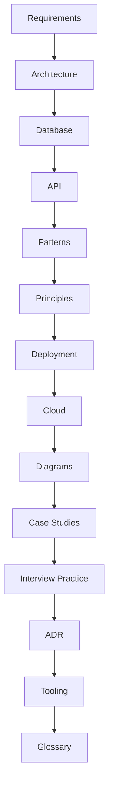
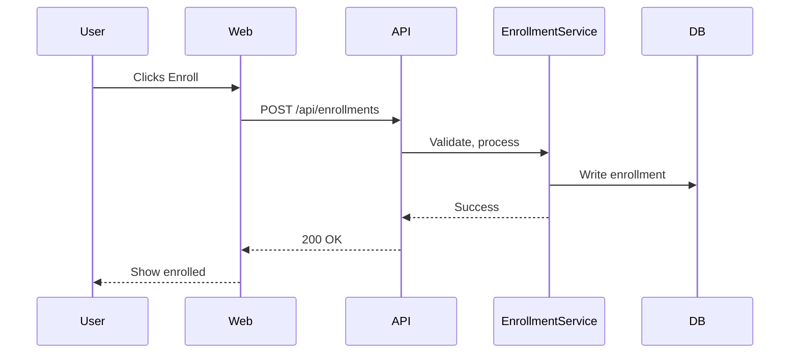

# SystemVerse Classic

Welcome to the **Classic** section of SystemVerse! This is your comprehensive, open, and modular resource for mastering system design fundamentals, principles, and real-world case studies.

---


## 📚 Project Structure

- **system-design-platform/**
  - [README](system-design-platform/README.md): Visual overview, navigation, and project goals
  - [requirements.md](system-design-platform/requirements.md): Deep-dive fundamentals & estimation
  - [principles.md](system-design-platform/principles.md): System design principles & frameworks
  - [patterns.md](system-design-platform/patterns.md): Design patterns (core, distributed, emerging)
  - [architecture.md](system-design-platform/architecture.md): High-level architecture
  - [database.md](system-design-platform/database.md): Database design
  - [api.md](system-design-platform/api.md): API design
  - [deployment.md](system-design-platform/deployment.md): CI/CD & deployment
  - [cloud.md](system-design-platform/cloud.md): Cloud-native design
  - [diagrams.md](system-design-platform/diagrams.md): Visuals & diagramming
  - [case-studies/](system-design-platform/case-studies/): 20+ real-world case studies
  - [interview-practice/](system-design-platform/interview-practice/): Interview prep & mock interviews
  - [adr/](system-design-platform/adr/): Architecture Decision Records
  - [tooling/](system-design-platform/tooling/): Tooling & templates

  - [glossary.md](system-design-platform/glossary.md): Glossary of terms

---

## 🏛️ Object-Oriented Analysis & Design (OOAD)

The OOAD section provides:
- Object-oriented design fundamentals and UML documentation
- 15+ real-world case studies (ATM, Chess, Facebook, LinkedIn, etc.)
- Example code implementations in Python
- Visual diagrams and media files

**Hierarchy:**

```
ooad/
  ├── example-codes/                  # Python code for all case studies
  ├── media-files/                     # Diagrams and images (UML, class, sequence, etc.)
  ├── object-oriented-design-and-uml/   # OOAD and UML theory docs
  ├── object-oriented-design-case-studies/ # Detailed case studies (design docs)
  └── readme.md                        # OOAD section overview and navigation
```

See [ooad/readme.md](ooad/readme.md) for full navigation and links to all content.

---


## 🧭 Quick Navigation

### Visual Table of Contents



- [System Design Platform Home](system-design-platform/README.md)
- [Fundamentals & Requirements](system-design-platform/requirements.md)
- [System Design Principles](system-design-platform/principles.md)
- [Design Patterns](system-design-platform/patterns.md)

### Architecture & Implementation
- [Architecture](system-design-platform/architecture.md)
- [Database Design](system-design-platform/database.md)
- [API Design](system-design-platform/api.md)

### Operations & Visualization
- [CI/CD & Deployment](system-design-platform/deployment.md)
- [Cloud-Native Design](system-design-platform/cloud.md)
- [Diagrams & Visuals](system-design-platform/diagrams.md)

### Data Flow Example (Enrollment)



### Practice & Reference
- [Case Studies](system-design-platform/case-studies/README.md)
- [Interview Practice](system-design-platform/interview-practice/README.md)
- [Architecture Decision Records (ADR)](system-design-platform/adr/README.md)
- [Tooling & Templates](system-design-platform/tooling/README.md)
- [Glossary](system-design-platform/glossary.md)

---

---

## 🚀 Implementation Roadmap & Tech Stack

**Implementation Roadmap:**
1. **MVP (Monolith/Modular):** Auth, user, catalog, enrollment, progress, quiz, forum, payment modules; REST API, PostgreSQL, Redis, CDN, Docker
2. **Add Observability:** Logging, metrics, tracing, alerting
3. **Asynchronous Workflows:** Message queue for notifications, grading
4. **Scale Out:** Split into microservices as needed (start with Enrollment, Payment, Forum)
5. **Cloud Deployment:** Containerize, deploy to Kubernetes, use managed DB/cache
6. **CI/CD Automation:** Automated tests, builds, deployments

**Suggested Tech Stack:**
- **Frontend:** React + TypeScript, Next.js, Tailwind CSS
- **Backend:** Node.js (Express/NestJS) or Python (FastAPI), gRPC for internal comms
- **Database:** PostgreSQL, Redis, MongoDB (for forums/search)
- **Caching:** Redis, CDN (Cloudflare/AWS CloudFront)
- **Streaming/Messaging:** RabbitMQ or Kafka
- **DevOps:** Docker, Kubernetes, GitHub Actions, ArgoCD, Prometheus, Grafana

**Trade-offs & Alternatives:**
- **Monolith vs. Microservices:** Monolith is simpler for MVP, easier to test/deploy. Microservices add complexity but scale better for large teams/features.
- **SQL vs. NoSQL:** SQL for strong consistency and relationships. NoSQL for flexible, high-volume data (forums, analytics).
- **REST vs. GraphQL:** REST is simple and well-supported. GraphQL offers flexible queries but adds complexity.
- **Cloud-native vs. On-prem:** Cloud-native is faster to scale, easier to manage, but can be more expensive.

---

## 🚀 How to Use
1. Start with the [System Design Platform Home](system-design-platform/README.md) for a visual overview and navigation.
2. Explore any topic or case study that interests you—each is self-contained and reference-rich.
3. Use the Interview Practice section to prepare for real interviews.
4. Contribute your own case studies, diagrams, or improvements (see CONTRIBUTING.md).

---

## 🌐 Free & Open Resources
- [The System Design Primer (GitHub)](https://github.com/donnemartin/system-design-primer)
- [Google Site Reliability Engineering Book](https://sre.google/books/)
- [Awesome Scalability](https://github.com/binhnguyennus/awesome-scalability)
- [Martin Fowler’s Architecture Patterns](https://martinfowler.com/architecture/)

For more, see the references in each section file.

---

This project is maintained by experienced architects and welcomes contributions. See `CONTRIBUTING.md` for details.
