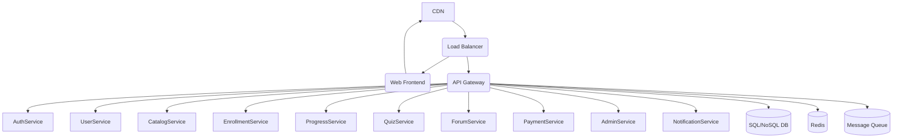
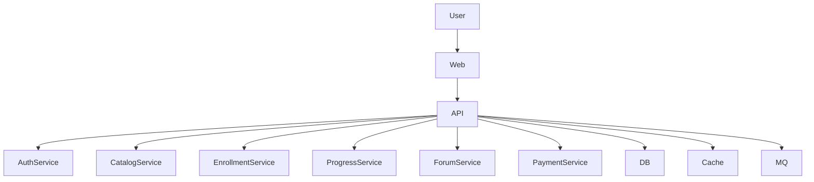
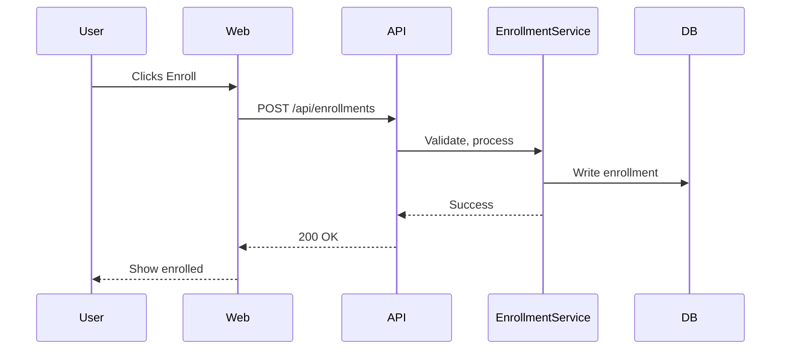

# End-to-End System Design Platform: Classic System Design

## 1. Functional Requirements
- User authentication (sign up, login, password reset)
- User profile management
- Course/catalog management (browse, search, filter)
- Enrollment (free/paid)
- Progress tracking (per module/lesson)
- Quizzes and assignments (auto/manual grading)
- Discussion forums (per module)
- Payments and subscriptions (Stripe/PayPal)
- Admin panel (manage content, users)

## 2. Non-Functional Requirements
- High availability (99.9%+ uptime)
- Low latency (sub-200ms for user actions)
- Fault tolerance (graceful degradation, retries)
- Security (OWASP, encryption, RBAC)
- Monitoring & observability (metrics, logs, alerts)
- Scalability (handle 10x user spikes)
- Maintainability (modular, testable codebase)

## 3. High-Level Architecture
**Pattern:** Modular Monolith (MVP) → Microservices (scale)

## 4. Database Design
- **Relational DB (PostgreSQL/MySQL):** Users, Catalog, Enrollments, Progress, Payments, Assignments, Forums
- **NoSQL (MongoDB/Elastic):** Forum posts, search index, analytics

**Data Modeling Example:**
- `User`: id, name, email, password_hash, role, created_at
- `CatalogItem`: id, title, description, price, published, created_at
- `Enrollment`: id, user_id, catalog_id, status, enrolled_at
- `Progress`: id, user_id, catalog_id, lesson_id, completed_at

**Caching:**
- Redis for session tokens, catalog, user progress
- CDN for static assets (images, videos, docs)

## 5. API Design
- **RESTful APIs** (OpenAPI/Swagger docs)
- **Endpoints:**
  - `/api/auth/*` (login, register, reset)
  - `/api/catalog/*` (list, detail, search)
  - `/api/enrollments/*` (enroll, status)
  - `/api/progress/*` (update, fetch)
  - `/api/quizzes/*` (submit, grade)
  - `/api/forums/*` (threads, posts)
  - `/api/payments/*` (initiate, verify)
- **Service Communication:**
  - Synchronous (HTTP/gRPC) for core flows
  - Asynchronous (RabbitMQ/Kafka) for notifications, grading, emails

## 6. Design Patterns & Principles
- **Singleton:** DB connection pool, config loader
- **Factory:** User/session/token creation
- **Observer:** Notification system (email/SMS on events)
- **Strategy:** Payment gateway selection, grading logic
- **Repository:** Data access abstraction
- **SOLID, DRY, KISS:** Modular, reusable, simple code

## 7. CI/CD & Deployment
- **CI:** GitHub Actions/GitLab CI for lint, test, build, Docker image
- **CD:** ArgoCD/Jenkins for deployment to Kubernetes/ECS
- **Testing:** Unit, integration, e2e, load tests
- **Blue/Green or Rolling Deployments**

## 8. Cloud-Native Considerations
- **Containers:** Docker for all services
- **Orchestration:** Kubernetes (EKS/GKE/AKS)
- **Cloud Services:** S3/GCS for file storage, RDS/CloudSQL for DB, Cloud CDN, Cloud Monitoring

## 9. Diagrams
### Component Diagram

### Data Flow (Enrollment)

## 10. Implementation Roadmap
1. **MVP (Monolith/Modular):** Auth, user, catalog, enrollment, progress, quiz, forum, payment modules; REST API, PostgreSQL, Redis, CDN, Docker
2. **Add Observability:** Logging, metrics, tracing, alerting
3. **Asynchronous Workflows:** Message queue for notifications, grading
4. **Scale Out:** Split into microservices as needed (start with Enrollment, Payment, Forum)
5. **Cloud Deployment:** Containerize, deploy to Kubernetes, use managed DB/cache
6. **CI/CD Automation:** Automated tests, builds, deployments

## 11. Suggested Tech Stack
- **Frontend:** React + TypeScript, Next.js, Tailwind CSS
- **Backend:** Node.js (Express/NestJS) or Python (FastAPI), gRPC for internal comms
- **Database:** PostgreSQL, Redis, MongoDB (for forums/search)
- **Caching:** Redis, CDN (Cloudflare/AWS CloudFront)
- **Streaming/Messaging:** RabbitMQ or Kafka
- **DevOps:** Docker, Kubernetes, GitHub Actions, ArgoCD, Prometheus, Grafana

## 12. Trade-offs & Alternatives
- **Monolith vs. Microservices:** Monolith is simpler for MVP, easier to test/deploy. Microservices add complexity but scale better for large teams/features.
- **SQL vs. NoSQL:** SQL for strong consistency and relationships. NoSQL for flexible, high-volume data (forums, analytics).
- **REST vs. GraphQL:** REST is simple and well-supported. GraphQL offers flexible queries but adds complexity.
- **Cloud-native vs. On-prem:** Cloud-native is faster to scale, easier to manage, but can be more expensive.

---

This design is practical, scalable, and ready for real-world implementation. Expand or request a deep dive into any component as needed.
