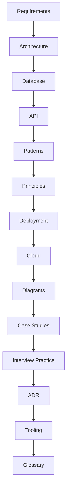
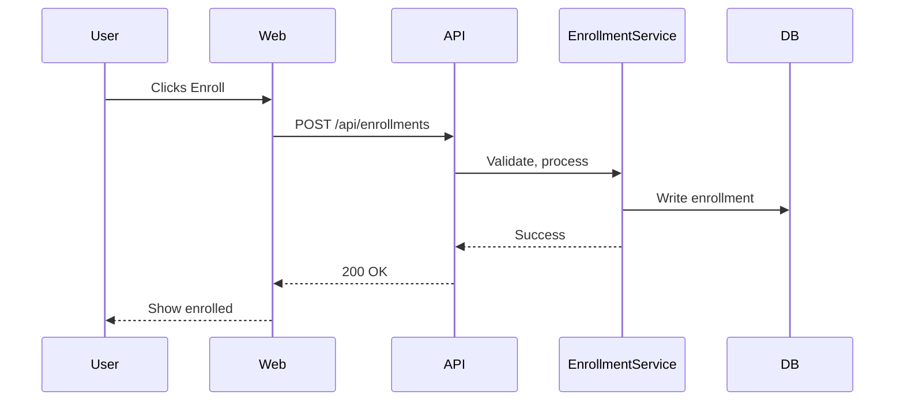

# System Design Platform — Classic

Welcome! This is your open, modular, and practical guide to mastering system design. Whether you’re a student, job-seeker, or working engineer, this section is built to help you learn, practice, and apply real-world system design skills.

## Visual Table of Contents



## 📚 What’s Inside
- 20+ real-world case studies (WhatsApp, Instagram, Uber, Twitter, LinkedIn, Google Search, Amazon, Facebook, Dropbox, Slack, Airbnb, YouTube, Pinterest, Zoom, Trello, Stripe, Shopify, GitHub, Reddit, Discord, Quora, Medium, Stack Overflow, Spotify, Flipkart, and more)
- Actionable checklists, templates, and diagrams for every major topic
- All references are free and open—no paywalls
- Designed for both self-study and group learning

## Learning Path
1. Start with `requirements.md` to understand the problem space and constraints
2. Study `architecture.md`, `patterns.md`, and `principles.md` for proven approaches and trade-offs
3. Use `database.md` and `api.md` for implementation details and interface design
4. Reference `deployment.md` and `cloud.md` for operationalizing your system
5. Use `diagrams.md` for visual summaries
6. Explore `case-studies/` for real-world examples
7. Try `interview-practice/` for hands-on prep
8. Check `glossary.md` for definitions and learning links

## 🌐 Free & Open Resources
All references and learning links in this project are free and open-source. See the end of each section for more, or start here:
- [System Design Primer (GitHub)](https://github.com/donnemartin/system-design-primer)
- [Google SRE Book](https://sre.google/books/)
- [Awesome Scalability](https://github.com/binhnguyennus/awesome-scalability)
- [OWASP Top 10](https://owasp.org/www-project-top-ten/)
- [Martin Fowler’s Architecture Patterns](https://martinfowler.com/architecture/)
- [Mermaid Live Editor](https://mermaid.live/)
- [PostgreSQL Docs](https://www.postgresql.org/docs/)
- [Kubernetes Docs](https://kubernetes.io/docs/)

---
This project is maintained by experienced architects and welcomes contributions. See `CONTRIBUTING.md` for details.
  API --> CatalogService
  API --> EnrollmentService
  API --> ProgressService
  API --> ForumService
  API --> PaymentService
  API --> DB
  API --> Cache
  API --> MQ
```

### Data Flow (Enrollment)


## 10. Implementation Roadmap
1. **MVP (Monolith/Modular):** Auth, user, catalog, enrollment, progress, quiz, forum, payment modules; REST API, PostgreSQL, Redis, CDN, Docker
2. **Add Observability:** Logging, metrics, tracing, alerting
3. **Asynchronous Workflows:** Message queue for notifications, grading
4. **Scale Out:** Split into microservices as needed (start with Enrollment, Payment, Forum)
5. **Cloud Deployment:** Containerize, deploy to Kubernetes, use managed DB/cache
6. **CI/CD Automation:** Automated tests, builds, deployments

## 11. Suggested Tech Stack
- **Frontend:** React + TypeScript, Next.js, Tailwind CSS
- **Backend:** Node.js (Express/NestJS) or Python (FastAPI), gRPC for internal comms
- **Database:** PostgreSQL, Redis, MongoDB (for forums/search)
- **Caching:** Redis, CDN (Cloudflare/AWS CloudFront)
- **Streaming/Messaging:** RabbitMQ or Kafka
- **DevOps:** Docker, Kubernetes, GitHub Actions, ArgoCD, Prometheus, Grafana

## 12. Trade-offs & Alternatives
- **Monolith vs. Microservices:** Monolith is simpler for MVP, easier to test/deploy. Microservices add complexity but scale better for large teams/features.
- **SQL vs. NoSQL:** SQL for strong consistency and relationships. NoSQL for flexible, high-volume data (forums, analytics).
- **REST vs. GraphQL:** REST is simple and well-supported. GraphQL offers flexible queries but adds complexity.
- **Cloud-native vs. On-prem:** Cloud-native is faster to scale, easier to manage, but can be more expensive.

---

This design is practical, scalable, and ready for real-world implementation. Expand or request a deep dive into any component as needed.
