```mermaid
graph TD
	A[System Design Platform] --> B[Requirements]
	A --> C[Principles]
	A --> D[Design Patterns]
	A --> E[Architecture]
	A --> F[Database]
	A --> G[API]
	A --> H[Deployment]
	A --> I[Cloud]
	A --> J[Diagrams]
	A --> K[Case Studies]
	K --> K1[Netflix]
	K --> K2[WhatsApp]
	K --> K3[Instagram]
	K --> K4[Uber]
	K --> K5[Twitter]
	K --> K6[LinkedIn]
	K --> K7[Google Search]
	K --> K8[Amazon]
	K --> K9[Facebook]
	K --> K10[Dropbox]
	K --> K11[Slack]
	K --> K12[Airbnb]
	K --> K13[YouTube]
	K --> K14[Pinterest]
	K --> K15[Zoom]
	K --> K16[Trello]
	K --> K17[Stripe]
	K --> K18[Shopify]
	K --> K19[GitHub]
	K --> K20[Reddit]
	K --> K21[Discord]
	K --> K22[Quora]
	K --> K23[Medium]
	K --> K24[Stack Overflow]
	K --> K25[Spotify]
	K --> K26[Flipkart]
	A --> L[Interview Practice]
	A --> M[ADR]
	A --> N[Tooling]
	A --> O[Glossary]
	A --> P[Services]
	P --> P1[Auth]
```

# System Design Platform — Classic

Welcome to your open, modular, and practical guide to mastering system design. This project is designed for students, job-seekers, and engineers who want to learn, practice, and apply real-world system design skills.

---

## 🧭 One-Click Navigation (Features & Sub-Features)

<strong>📚 Core Theory</strong>

| 📂 Section         | 🔗 Link | 📝 Sub-Features |
|--------------------|--------|----------------|
| Requirements       | [requirements.md](requirements.md) | Fundamentals, Estimation, Constraints |
| Principles         | [principles.md](principles.md) | Systematic Design, Trade-offs, Reliability, Security, Observability, Cost, Communication |
| Design Patterns    | [patterns.md](patterns.md) | Core, Distributed, Emerging Patterns, Diagrams, Trade-off Tables |

<strong>🏗️ Architecture & Implementation</strong>

| 📂 Section         | 🔗 Link | 📝 Sub-Features |
|--------------------|--------|----------------|
| Architecture       | [architecture.md](architecture.md) | High-level Design, Data Flow, Component Diagrams |
| Database           | [database.md](database.md) | Data Modeling, Indexing, Partitioning, Scaling |
| API                | [api.md](api.md) | API Design, Contracts, Versioning, OpenAPI |

<strong>⚙️ Operations & Visualization</strong>

| 📂 Section         | 🔗 Link | 📝 Sub-Features |
|--------------------|--------|----------------|
| Deployment         | [deployment.md](deployment.md) | CI/CD, Rollbacks, Blue-Green, Canary |
| Cloud              | [cloud.md](cloud.md) | Cloud-Native, Multi-Region, Resilience |
| Diagrams           | [diagrams.md](diagrams.md) | Visuals, Mermaid, Sequence, Component |

<strong>🧑‍💻 Practice & Reference</strong>

| 📂 Section         | 🔗 Link | 📝 Sub-Features |
|--------------------|--------|----------------|
| Case Studies       | [case-studies/README.md](case-studies/README.md) | [Netflix](case-studies/netflix.md), [WhatsApp](case-studies/whatsapp.md), [Instagram](case-studies/instagram.md), [Uber](case-studies/uber.md), [Twitter](case-studies/twitter.md), [LinkedIn](case-studies/linkedin.md), [Google Search](case-studies/google-search.md), [Amazon](case-studies/amazon.md), [Facebook](case-studies/facebook.md), [Dropbox](case-studies/dropbox.md), [Slack](case-studies/slack.md), [Airbnb](case-studies/airbnb.md), [YouTube](case-studies/youtube.md), [Pinterest](case-studies/pinterest.md), [Zoom](case-studies/zoom.md), [Trello](case-studies/trello.md), [Stripe](case-studies/stripe.md), [Shopify](case-studies/shopify.md), [GitHub](case-studies/github.md), [Reddit](case-studies/reddit.md), [Discord](case-studies/discord.md), [Quora](case-studies/quora.md), [Medium](case-studies/medium.md), [Stack Overflow](case-studies/stack-overflow.md), [Spotify](case-studies/spotify.md), [Flipkart](case-studies/flipkart.md) |
| Interview Practice | [interview-practice/README.md](interview-practice/README.md) | Mock Interviews, Q&A, Scenarios |
| ADR                | [adr/README.md](adr/README.md) | Architecture Decision Records, Example: [Monolith vs Microservices](adr/0001-monolith-vs-microservices.md) |
| Tooling            | [tooling/README.md](tooling/README.md) | Templates, [Mermaid Example](tooling/mermaid-template.md) |
| Glossary           | [glossary.md](glossary.md) | Terms, Definitions, Learning Links |
| Services (Auth)    | [services/auth/README.md](services/auth/README.md) | OpenAPI Spec, Auth Service Example |

---

## 🗂️ Visual Project Hierarchy

---

## 📚 Free & Open Resources

- [The System Design Primer (GitHub)](https://github.com/donnemartin/system-design-primer)
- [Google Site Reliability Engineering Book](https://sre.google/books/)
- [Awesome Scalability, Availability, and Stability](https://github.com/binhnguyennus/awesome-scalability)
- [OWASP Top 10](https://owasp.org/www-project-top-ten/)
- [Martin Fowler’s Architecture Patterns](https://martinfowler.com/architecture/)
- [Mermaid Live Editor](https://mermaid.live/)
- [PostgreSQL Official Docs](https://www.postgresql.org/docs/)
- [Kubernetes Official Docs](https://kubernetes.io/docs/)

For more, see the references in each section file.

---

## 📚 Free & Open Resources

- [The System Design Primer (GitHub)](https://github.com/donnemartin/system-design-primer)
- [Google Site Reliability Engineering Book](https://sre.google/books/)
- [Awesome Scalability, Availability, and Stability](https://github.com/binhnguyennus/awesome-scalability)
- [OWASP Top 10](https://owasp.org/www-project-top-ten/)
- [Martin Fowler’s Architecture Patterns](https://martinfowler.com/architecture/)
- [Mermaid Live Editor](https://mermaid.live/)
- [PostgreSQL Official Docs](https://www.postgresql.org/docs/)
- [Kubernetes Official Docs](https://kubernetes.io/docs/)

For more, see the references in each section file.

---

## 🤝 How to Contribute
- See [CONTRIBUTING.md](CONTRIBUTING.md) for guidelines.
- Suggest improvements, add case studies, or submit corrections via pull request.

---

## Project Goals
- Provide a modular, reference-quality set of documents covering all major aspects of system design.
- Serve as a learning and interview preparation resource, as well as a practical guide for real-world projects.
- Link to authoritative references, industry standards, and best practices throughout.

---

## Recommended References
- [Designing Data-Intensive Applications](https://dataintensive.net/) by Martin Kleppmann
- [The System Design Primer](https://github.com/donnemartin/system-design-primer) (GitHub)
- [Building Microservices](https://www.oreilly.com/library/view/building-microservices-2nd/9781492034018/) by Sam Newman
- [Google Site Reliability Engineering Book](https://sre.google/books/)
- [AWS Well-Architected Framework](https://aws.amazon.com/architecture/well-architected/)
- [Martin Fowler’s Architecture Patterns](https://martinfowler.com/architecture/)

---

This project is maintained by experienced architects and welcomes contributions. See `CONTRIBUTING.md` for details.