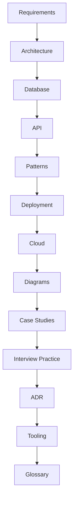

# Visual Table of Contents

## Free Resources

Explore these free, high-quality resources to deepen your system design knowledge:

- [The System Design Primer (GitHub)](https://github.com/donnemartin/system-design-primer) — Comprehensive, open-source guide to system design.
- [Google Site Reliability Engineering Book](https://sre.google/books/) — Free online book on reliability, scalability, and operations.
- [Awesome Scalability, Availability, and Stability](https://github.com/binhnguyennus/awesome-scalability) — Curated list of free articles, videos, and papers.
- [OWASP Top 10](https://owasp.org/www-project-top-ten/) — Free security best practices.
- [Martin Fowler’s Architecture Patterns](https://martinfowler.com/architecture/) — Free essays on architecture and design.
- [Mermaid Live Editor](https://mermaid.live/) — Free tool for creating diagrams.
- [PostgreSQL Official Docs](https://www.postgresql.org/docs/) — Free, authoritative database documentation.
- [Kubernetes Official Docs](https://kubernetes.io/docs/) — Free, comprehensive cloud orchestration guide.

For more, see the references in each section file.

# System Design Platform — Classic

Welcome! This is your open, modular, and practical guide to mastering system design. Whether you’re a student, job-seeker, or working engineer, this section is built to help you learn, practice, and apply real-world system design skills.

**How to use this resource:**
- Start with the Visual Table of Contents below for a quick overview.
- Dive into any topic or case study that interests you—each is self-contained and reference-rich.
- Use the Interview Practice section to prepare for real interviews.
- Explore the Glossary for definitions and links to free learning resources.
- Contribute your own case studies, diagrams, or improvements (see CONTRIBUTING.md).

**What makes this classic section unique?**
- 20+ real-world case studies, each with architecture, challenges, and links to engineering blogs.
- Actionable checklists, templates, and diagrams for every major topic.
- All references are free and open—no paywalls.
- Designed for both self-study and group learning.

## 🧭 Navigation

- [Fundamentals & Requirements](requirements.md)
- [Architecture](architecture.md)
- [Database Design](database.md)
- [API Design](api.md)
- [System Design Principles](principles.md)
- [Design Patterns](patterns.md)
- [CI/CD & Deployment](deployment.md)
- [Cloud-Native Design](cloud.md)
- [Diagrams & Visuals](diagrams.md)
- [Case Studies](case-studies/README.md) — 20+ real-world systems:
	- [Netflix](case-studies/netflix.md), [WhatsApp](case-studies/whatsapp.md), [Instagram](case-studies/instagram.md), [Uber](case-studies/uber.md), [Twitter](case-studies/twitter.md), [LinkedIn](case-studies/linkedin.md), [Google Search](case-studies/google-search.md), [Amazon](case-studies/amazon.md), [Facebook](case-studies/facebook.md), [Dropbox](case-studies/dropbox.md), [Slack](case-studies/slack.md), [Airbnb](case-studies/airbnb.md), [YouTube](case-studies/youtube.md), [Pinterest](case-studies/pinterest.md), [Zoom](case-studies/zoom.md), [Trello](case-studies/trello.md), [Stripe](case-studies/stripe.md), [Shopify](case-studies/shopify.md), [GitHub](case-studies/github.md), [Reddit](case-studies/reddit.md), [Discord](case-studies/discord.md), [Quora](case-studies/quora.md), [Medium](case-studies/medium.md), [Stack Overflow](case-studies/stack-overflow.md), [Spotify](case-studies/spotify.md), [Flipkart](case-studies/flipkart.md)
- [Interview Practice](interview-practice/README.md)
- [Architecture Decision Records (ADR)](adr/README.md)
- [Tooling & Templates](tooling/README.md)
- [Glossary](glossary.md)
- [Free & Open Resources](#free--open-resources)

Welcome to the System Design Platform (Classic). This project is a comprehensive, theory-driven guide to designing scalable, maintainable, and robust software systems. It is intended for engineers, architects, and students who want to master the art and science of system design.

## Project Goals
- Provide a modular, reference-quality set of documents covering all major aspects of system design.
- Serve as a learning and interview preparation resource, as well as a practical guide for real-world projects.
- Link to authoritative references, industry standards, and best practices throughout.

## Structure
## 📚 What’s Inside

## How to Use
1. Start with `requirements.md` to understand the problem space and constraints.
2. Study `architecture.md` and `patterns.md` for proven approaches and trade-offs.
3. Use `database.md` and `api.md` for implementation details and interface design.
4. Reference `deployment.md` and `cloud.md` for operationalizing your system.
5. Use `diagrams.md` for visual summaries.

## Recommended References
- [Designing Data-Intensive Applications](https://dataintensive.net/) by Martin Kleppmann
- [The System Design Primer](https://github.com/donnemartin/system-design-primer) (GitHub)
- [Building Microservices](https://www.oreilly.com/library/view/building-microservices-2nd/9781492034018/) by Sam Newman
- [Google Site Reliability Engineering Book](https://sre.google/books/)
- [AWS Well-Architected Framework](https://aws.amazon.com/architecture/well-architected/)
- [Martin Fowler’s Architecture Patterns](https://martinfowler.com/architecture/)

---
This project is maintained by experienced architects and welcomes contributions. See `CONTRIBUTING.md` for details.