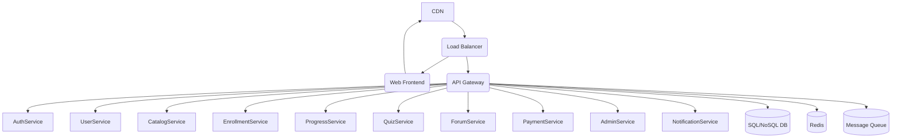

# High-Level Architecture

System architecture is the blueprint for your platform. It defines how components interact, how data flows, and how the system meets its requirements. A well-architected system balances trade-offs between scalability, maintainability, and cost.

## Core Architectural Patterns

### 1. Modular Monolith (MVP)
- Start with a single deployable unit, but organize code into modules with clear boundaries.
- Enables rapid iteration, easier refactoring, and clear ownership.
- **Checklist:**
  - [ ] Codebase is organized by feature/module
  - [ ] Clear API boundaries between modules
  - [ ] Automated tests for each module
  - [ ] See [Martin Fowler, MonolithFirst](https://martinfowler.com/bliki/MonolithFirst.html)

### 2. Microservices (at scale)
- As the system grows, split modules into independently deployable services.
- Use API gateways, service discovery, and distributed tracing.
- **Checklist:**
  - [ ] Each service has its own codebase and deployment pipeline
  - [ ] API gateway handles routing, authentication, and rate limiting
  - [ ] Centralized logging and distributed tracing in place
  - [ ] See [Building Microservices, Sam Newman]

### 3. Event-Driven Architecture
- Use message queues (Kafka, RabbitMQ) for decoupling and async processing.
- Enables scalability and resilience for background jobs, notifications, and analytics.

### 4. Layered Architecture
- Separate presentation, business logic, and data access layers.
- Promotes maintainability and testability.

---

## Example Architecture Diagram

---

## Key Architectural Considerations

### 1. Separation of Concerns
- Each service/module should have a single responsibility.
- Avoid tight coupling between modules.

### 2. Statelessness
- Design services to be stateless where possible for easier scaling.
- Store session state in external stores (Redis, DB) if needed.

### 3. API Gateway
- Central entry point for authentication, rate limiting, and routing.
- Can provide protocol translation (REST ↔ gRPC).

### 4. Caching
- Use Redis or Memcached to reduce DB load and improve latency.
- Cache at multiple layers: CDN, API, DB query results.

### 5. Message Queues
- Use for async processing (emails, notifications, grading).
- Decouple producers and consumers for resilience.

### 6. Observability
- Centralized logging, metrics, and tracing are essential for debugging distributed systems.
- Use tools like Prometheus, Grafana, ELK stack, and Jaeger.

### 7. Security
- Secure all internal and external communication (TLS).
- Use RBAC and least-privilege principles for service-to-service communication.

---

## Actionable Checklist
- [ ] Choose an initial architecture (monolith, microservices, or hybrid)
- [ ] Document all service boundaries and APIs
- [ ] Implement centralized logging and monitoring
- [ ] Use infrastructure-as-code for repeatable deployments
- [ ] Regularly review architecture for bottlenecks and single points of failure

---

## References
- [Microservices vs. Monolith](https://martinfowler.com/articles/microservices.html)
- [Google Cloud Architecture Center](https://cloud.google.com/architecture)
- [12 Factor App](https://12factor.net/)
- [Awesome Scalability](https://github.com/binhnguyennus/awesome-scalability)
