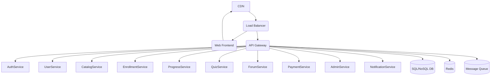

# High-Level Architecture

System architecture is the blueprint for your platform. It defines how components interact, how data flows, and how the system meets its requirements. A well-architected system balances trade-offs between scalability, maintainability, and cost.

## Patterns
- **Modular Monolith (MVP):** Start with a single deployable unit, but organize code into modules with clear boundaries. This enables rapid iteration and easier refactoring. [See: Martin Fowler, MonolithFirst](https://martinfowler.com/bliki/MonolithFirst.html)
- **Microservices (at scale):** As the system grows, split modules into independently deployable services. Use API gateways, service discovery, and distributed tracing. [Building Microservices, Sam Newman]

## Example Architecture Diagram

## Key Considerations
- **Separation of concerns:** Each service/module should have a single responsibility.
- **Statelessness:** Design services to be stateless where possible for easier scaling.
- **API Gateway:** Central entry point for authentication, rate limiting, and routing.
- **Caching:** Use Redis or Memcached to reduce DB load and improve latency.
- **Message Queues:** Use for async processing (emails, notifications, grading).
- **Observability:** Centralized logging, metrics, and tracing are essential for debugging distributed systems.

## References
- [Microservices vs. Monolith](https://martinfowler.com/articles/microservices.html)
- [Google Cloud Architecture Center](https://cloud.google.com/architecture)
- [12 Factor App](https://12factor.net/)
- [Awesome Scalability](https://github.com/binhnguyennus/awesome-scalability)
