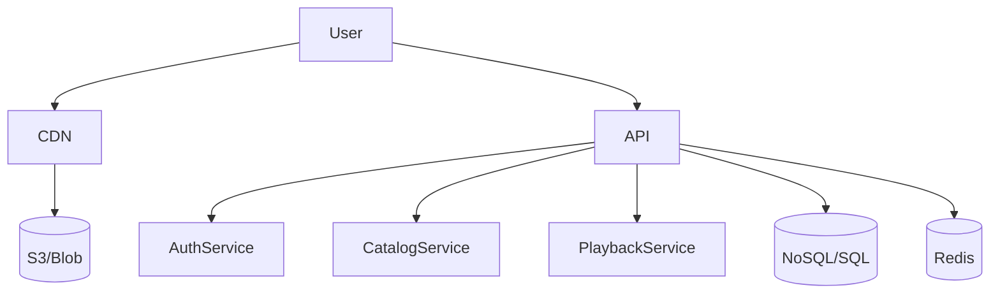

# Case Study: Netflix Global Video Streaming

## Problem Statement
Design a scalable, highly available video streaming platform serving millions of users worldwide.

## High-Level Architecture
- CDN for video delivery
- Microservices for user, catalog, and playback
- NoSQL for metadata, distributed SQL for billing
- Caching for recommendations and session data

## Key Challenges & Solutions
- **Scalability:** Use microservices, sharding, and global CDNs
- **Availability:** Multi-region failover, redundancy
- **Performance:** Edge caching, adaptive bitrate streaming
- **Data Consistency:** Eventual consistency for non-critical data

## Diagram

## References
- [Netflix Tech Blog](https://netflixtechblog.com/)
- [High Scalability: Netflix Architecture](http://highscalability.com/blog/2016/1/25/how-netflix-works-the-huge-architecture-behind-streaming.html)
- [AWS Architecture Blog: Netflix](https://aws.amazon.com/architecture/case-studies/netflix/)
- [Awesome Scalability](https://github.com/binhnguyennus/awesome-scalability)
- [InfoQ: Netflix Engineering](https://www.infoq.com/Netflix/)
