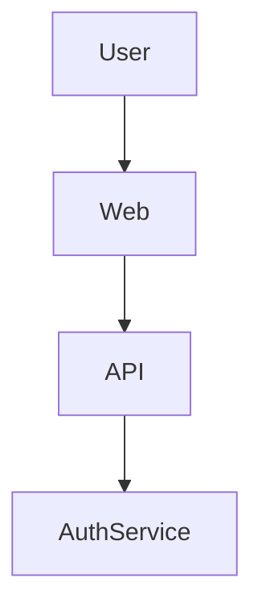

# Diagrams

Visual diagrams are essential for communicating system architecture, data flows, and component interactions. Use standardized notation and keep diagrams up to date with system changes.

## Component Diagram

## Best Practices
- Use clear, consistent symbols and labels.
- Show only relevant details for the intended audience (e.g., high-level for execs, detailed for engineers).
- Keep diagrams versioned alongside code/docs.

## Tools & References
- [Mermaid Live Editor](https://mermaid.live/)
- [C4 Model for Visualising Software Architecture](https://c4model.com/)
- [PlantUML](https://plantuml.com/)
- [Awesome Scalability](https://github.com/binhnguyennus/awesome-scalability)
