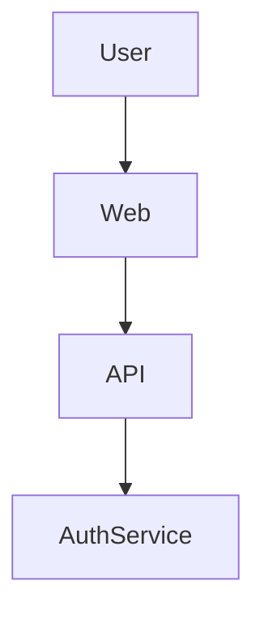
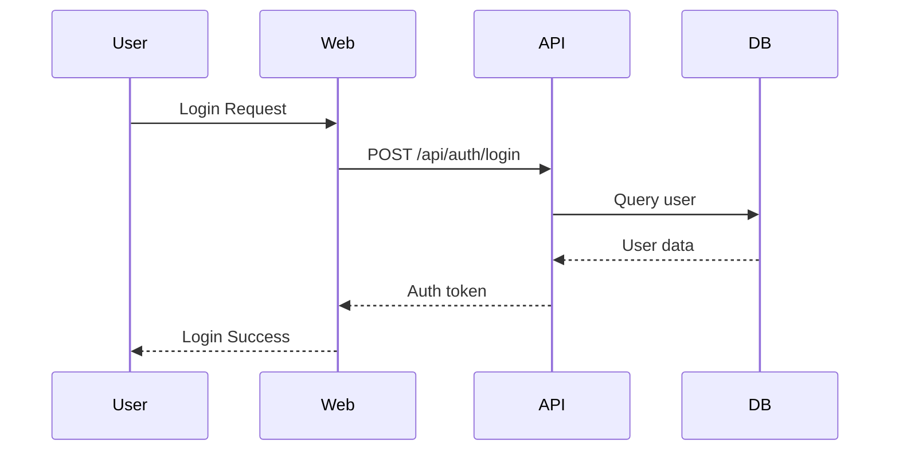

# Diagrams

Visual diagrams are essential for communicating system architecture, data flows, and component interactions. This section covers practical strategies, examples, and checklists for effective diagrams.

## Component Diagram Example

## Sequence Diagram Example

---

## Best Practices
- Use clear, consistent symbols and labels.
- Show only relevant details for the intended audience (e.g., high-level for execs, detailed for engineers).
- Keep diagrams versioned alongside code/docs.
- Use color and grouping to highlight key flows.
- Prefer open formats (Mermaid, PlantUML) for version control.

---

## Actionable Checklist
- [ ] All major flows have a diagram
- [ ] Diagrams are updated with system changes
- [ ] Diagrams are reviewed during design reviews

---

## Tools & References
- [Mermaid Live Editor](https://mermaid.live/)
- [C4 Model for Visualising Software Architecture](https://c4model.com/)
- [PlantUML](https://plantuml.com/)
- [Awesome Scalability](https://github.com/binhnguyennus/awesome-scalability)
