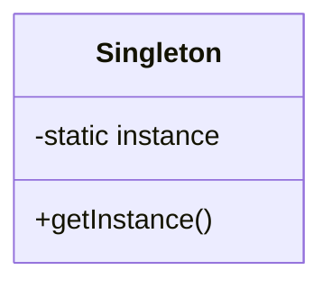
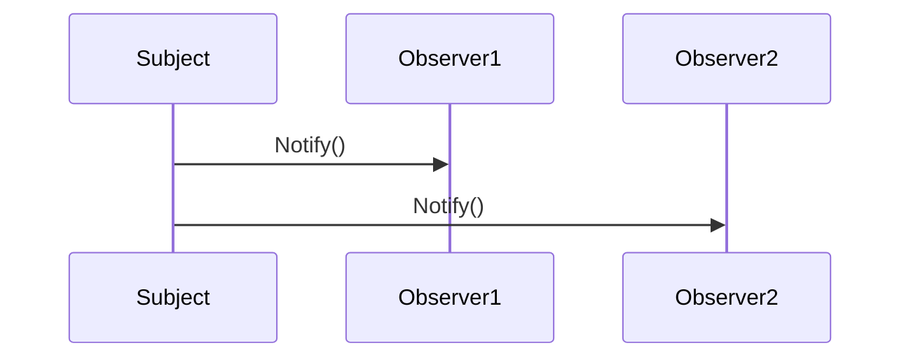
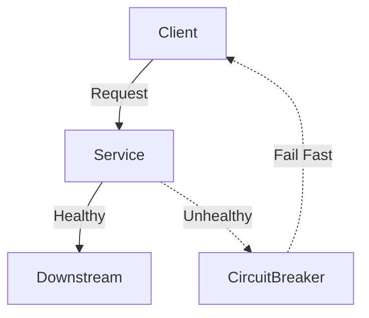
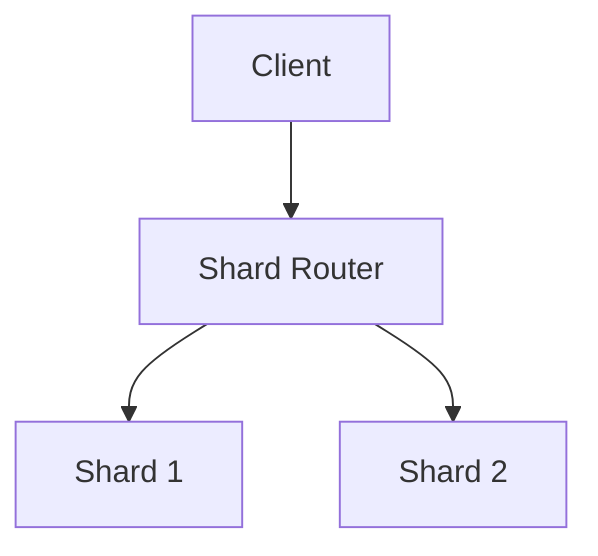

# Design Patterns in System Design

## Deep Dive: Design Patterns for Modern Systems

### 1. Core Patterns (with Examples)

#### Singleton
- **What:** Ensure a class has only one instance (e.g., DB connection pool, config loader).
- **When to use:** Global state, shared resources.
- **Pros/Cons:** Simple, but can hide dependencies and hurt testability.
- **Diagram:**

- **Real-world:** Logger, DB connection pool.

#### Factory
- **What:** Encapsulate object creation logic.
- **When to use:** When object creation is complex or needs to vary by context.
- **Example:** UserFactory creates different user types.

#### Observer
- **What:** Notify dependent components of state changes.
- **When to use:** Event-driven architectures (e.g., notification system).
- **Diagram:**

#### Strategy
- **What:** Encapsulate interchangeable algorithms.
- **When to use:** Pluggable logic (e.g., payment gateway selection).

#### Repository
- **What:** Abstract data access.
- **When to use:** Decouple business logic from persistence.

#### Proxy
- **What:** Control access to another object.
- **When to use:** API gateway, rate limiting, authentication.

#### Adapter
- **What:** Allow incompatible interfaces to work together.
- **When to use:** Integrating legacy systems.

#### Circuit Breaker
- **What:** Prevent cascading failures by failing fast when a downstream service is unhealthy.
- **When to use:** External API calls, microservices.
- **Diagram:**

#### CQRS
- **What:** Separate read and write models for scalability and flexibility.
- **When to use:** High-scale systems, analytics, event sourcing.

#### Event Sourcing
- **What:** Persist state as a sequence of events.
- **When to use:** Auditability, replay, complex state transitions.

#### Bulkhead
- **What:** Isolate components to prevent failure from spreading.
- **When to use:** Thread pools per service, microservices.

#### Cache-Aside
- **What:** Load data into cache only on demand.
- **When to use:** Read-heavy workloads, caching with Redis.

---

### 2. Distributed Patterns

#### Sharding
- **What:** Partitioning data for scale (e.g., user_id % N).
- **Trade-offs:** Rebalancing, hot spots, cross-shard queries.
- **Diagram:**

- **Real-world:** Twitter timelines, MongoDB sharding.

#### Replication
- **What:** Master-slave, multi-leader, leaderless.
- **Trade-offs:** Consistency, failover, split-brain.
- **Real-world:** MySQL replication, Cassandra.

#### Leader Election
- **What:** Ensures single source of truth for coordination.
- **How:** Paxos, Raft, Zookeeper.

#### Consensus
- **What:** Achieving agreement in distributed systems (Paxos, Raft, 2PC, 3PC).

#### Eventual Consistency
- **What:** Updates propagate over time.
- **When to use:** High-availability systems (Dynamo, Cassandra).

#### Idempotency
- **What:** Ensuring repeated operations have the same effect.
- **When to use:** Payment APIs, distributed jobs.

#### Deduplication
- **What:** Handling duplicate messages/events in distributed queues.

#### Distributed Locks
- **What:** Redis/Zookeeper-based locks, fencing tokens, failure handling.

#### Gossip Protocols
- **What:** Peer-to-peer state dissemination (Cassandra, Dynamo).

---

### 3. Emerging Patterns

#### Saga
- **What:** Distributed transactions via sequence of local transactions and compensating actions.
- **When to use:** Microservices, e-commerce orders.

#### Outbox
- **What:** Reliable event publishing from databases.

#### Sidecar
- **What:** Deploying helper processes alongside main services (service mesh, logging, monitoring).

#### Service Mesh
- **What:** Managing service-to-service communication, security, and observability (Istio, Linkerd).

#### Anti-entropy
- **What:** Background reconciliation to ensure consistency (Dynamo, Cassandra).

---

### 4. Anti-patterns

- **Single Point of Failure:** No redundancy, one component brings down the system.
- **Tight Coupling:** Hard to change or scale components independently.
- **Premature Optimization:** Overengineering before real bottlenecks are known.
- **God Object:** One module/class does too much, hard to maintain/test.
- **Other:** Stale cache, split-brain, thundering herd, etc.

---

## For Each Pattern
- **What it is**
- **When to use**
- **Pros/Cons**
- **Code/diagram example**
- **Real-world usage**
- **Trade-off table**

---

| Pattern         | Pros                        | Cons                        | Example Use Case         |
|-----------------|-----------------------------|-----------------------------|-------------------------|
| Singleton       | Simple, global state        | Hidden deps, testability    | Logger, config loader   |
| Sharding        | Scalable, parallelism       | Rebalancing, hot spots      | Twitter timelines       |
| CQRS            | Scalability, flexibility    | Complexity, eventual cons.  | Analytics, event sourcing|
| Circuit Breaker | Prevents cascading failure  | Added latency, config       | API calls, microservices|

---

## Example: Circuit Breaker Diagram
...existing code...
