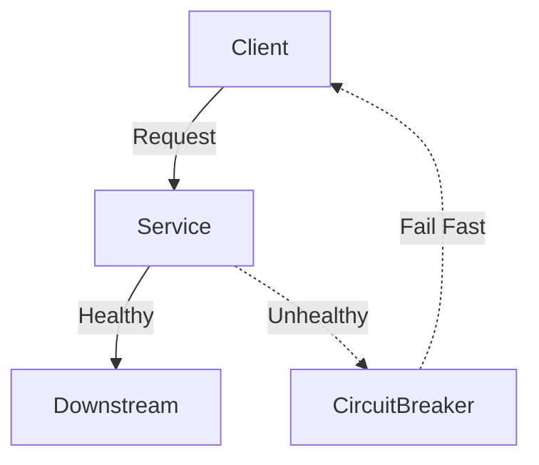

# Design Patterns in System Design

Design patterns are proven, reusable solutions to common problems in software architecture. This section expands on each pattern with practical examples and checklists.

## Core Patterns (with Examples)

### 1. Singleton
- Ensure a class has only one instance (e.g., DB connection pool, config loader).
- **Checklist:**
	- [ ] Only one instance created per process
	- [ ] Thread-safe implementation
	- [ ] Used only where global state is required
	- [ ] See [GoF Design Patterns]

### 2. Factory
- Encapsulate object creation logic (e.g., user/session/token creation). Promotes loose coupling.
- **Example:** UserFactory creates different user types based on input.

### 3. Observer
- Notify dependent components of state changes (e.g., notification system for emails/SMS). Enables event-driven architectures.
- **Checklist:**
	- [ ] Observers can subscribe/unsubscribe at runtime
	- [ ] State changes are broadcast to all observers

### 4. Strategy
- Encapsulate interchangeable algorithms (e.g., payment gateway selection, grading logic).
- **Example:** Different grading strategies for quizzes (average, best, latest).

### 5. Repository
- Abstract data access, enabling decoupling between business logic and persistence.
- **Checklist:**
	- [ ] All data access goes through repository interfaces
	- [ ] Easy to swap DB implementations

### 6. Proxy
- Control access to another object (e.g., API gateway as a proxy to microservices).
- **Example:** Rate limiting and authentication at the proxy layer.

### 7. Adapter
- Allow incompatible interfaces to work together (e.g., integrating legacy systems).
- **Checklist:**
	- [ ] Adapter implements target interface
	- [ ] No changes required to existing code

### 8. Circuit Breaker
- Prevent cascading failures by "tripping" and failing fast when a downstream service is unhealthy.
- **Checklist:**
	- [ ] Circuit trips after N failures
	- [ ] Automatic reset after cooldown
	- [ ] See [Martin Fowler: Circuit Breaker](https://martinfowler.com/bliki/CircuitBreaker.html)

### 9. CQRS (Command Query Responsibility Segregation)
- Separate read and write models for scalability and flexibility.
- **Checklist:**
	- [ ] Separate models for reads and writes
	- [ ] Eventual consistency handled where needed
	- [ ] See [Microsoft Docs: CQRS](https://learn.microsoft.com/en-us/azure/architecture/patterns/cqrs)

### 10. Event Sourcing
- Persist state as a sequence of events, enabling auditability and replay.
- **Checklist:**
	- [ ] All state changes recorded as events
	- [ ] Event replay supported for recovery
	- [ ] See [Event Sourcing](https://martinfowler.com/eaaDev/EventSourcing.html)

### 11. Bulkhead
- Isolate components to prevent failure from spreading (e.g., thread pools per service).

### 12. Cache-Aside
- Load data into cache only on demand (e.g., Redis as a read-through cache).
- **Checklist:**
	- [ ] Cache invalidation handled on updates
	- [ ] Cache hit/miss metrics monitored

---

## Example: Circuit Breaker Diagram

---

## Architectural Principles (Quick Reference)
- **SOLID:** Five principles for maintainable, extensible code (Single Responsibility, Open/Closed, Liskov Substitution, Interface Segregation, Dependency Inversion). [SOLID Principles](https://en.wikipedia.org/wiki/SOLID)
- **DRY (Don’t Repeat Yourself):** Avoid code duplication.
- **KISS (Keep It Simple, Stupid):** Prefer simplicity over complexity.
- **YAGNI (You Aren’t Gonna Need It):** Don’t implement features until necessary.

---

## References
- [Design Patterns: Elements of Reusable Object-Oriented Software](https://en.wikipedia.org/wiki/Design_Patterns) (GoF)
- [Refactoring Guru: Patterns](https://refactoring.guru/design-patterns)
- [Microsoft Cloud Design Patterns](https://learn.microsoft.com/en-us/azure/architecture/patterns/)
- [Awesome Scalability](https://github.com/binhnguyennus/awesome-scalability)
