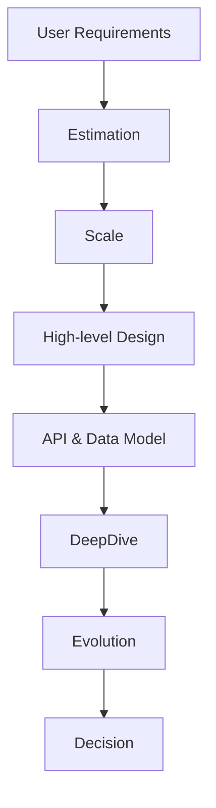
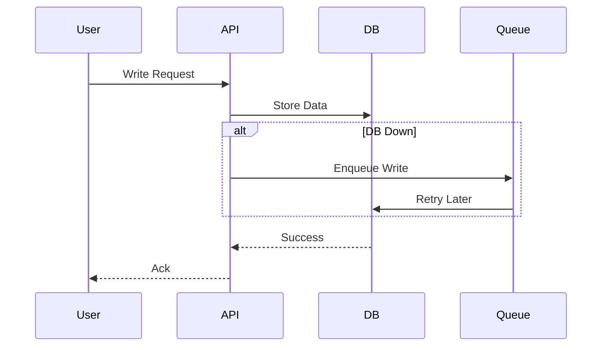

# System Design Principles
## Deep Dive: System Design Principles & Frameworks

# System Design Principles

---

## 🧭 Visual Navigation & Quick Links

| Principle | Summary | Checklist | Example/Diagram |
|-----------|---------|-----------|-----------------|
| [Design for Evolution](#0-design-for-evolution) | Versioning, migrations, feature growth | ✔️ | - |
| [Systematic Design (RESHADED)](#1-systematic-design-approach-reshaded-framework) | Stepwise design process | ✔️ | [Mermaid Flow](#diagram-example) |
| [Trade-offs](#2-explicit-handling-of-trade-offs) | Documenting and justifying choices | ✔️ | Table, Example |
| [Reliability & Chaos](#3-reliability-capacity--chaos-engineering) | SLI/SLO/SLA, chaos, bottlenecks | ✔️ | Table |
| [Security](#4-security-principles) | Defense in depth, least privilege | ✔️ | - |
| [Observability](#5-observability-as-a-first-class-principle) | Metrics, logs, SLOs | ✔️ | - |
| [Cost Awareness](#6-cost-awareness) | Efficiency, monitoring | ✔️ | - |
| [Communication & Diagrams](#7-communication-and-diagramming) | Whiteboarding, walkthroughs | ✔️ | [Mermaid Sequence](#diagram-example-1) |

**Quick Access:**
- [RESHADED Table](#1-systematic-design-approach-reshaded-framework)
- [Trade-off Table](#2-explicit-handling-of-trade-offs)
- [Reliability Table](#3-reliability-capacity--chaos-engineering)
- [Security Checklist](#4-security-principles)
- [Mermaid Diagrams](#diagram-example), [Sequence Example](#diagram-example-1)

---

## Deep Dive: System Design Principles & Frameworks

### 0. Design for Evolution
- **Versioning:** APIs, data models, and protocols should be versioned for backward compatibility.
- **Migrations:** Plan for zero-downtime schema/data migrations.
- **Feature Growth:** Use feature flags, gradual rollouts, and A/B testing.
- **Checklist:**
	- [ ] All APIs/data models are versioned
	- [ ] Migration plans are documented
	- [ ] Feature flags in place for risky changes

---

### 1. Systematic Design Approach (RESHADED Framework)

| Step         | What to Cover                                                                 |
|--------------|-------------------------------------------------------------------------------|
| Requirements | Clarify functional/non-functional needs, constraints, and success metrics     |
| Estimation   | Back-of-the-envelope calculations for scale, storage, bandwidth, and traffic  |
| Scale        | Identify scaling needs, bottlenecks, partitioning strategies                  |
| High-level   | Draw main components, data flow, and interactions                             |
| API/Data     | Define key APIs, data schemas, and contracts                                  |
| Deep Dive    | Focus on critical components (DB, cache, queue, consistency, failure handling) |
| Evolution    | Plan for future growth, migrations, feature changes                           |
| Decision     | Justify trade-offs, alternatives, and why you chose this approach             |

**Checklist:**
- [ ] Each design step is explicitly addressed in interviews or docs
- [ ] Trade-offs and alternatives are discussed

**Diagram Example:**

---

### 2. Explicit Handling of Trade-offs

- **How to Document and Communicate Trade-offs:**
	- Use trade-off tables for common decisions (SQL vs NoSQL, monolith vs microservices, etc.).
	- Always state what you gain and what you lose.
	- Example: “Choosing NoSQL gives us scalability and flexibility, but we lose strong consistency.”

---

**How to Justify Choices:**
- Always state the trade-off: “I chose X over Y because…”
- Use real-world analogies: “Like DynamoDB, we favor availability over consistency for user feeds.”
- Address interviewer’s follow-ups: “If strict ordering is needed, we can use a queue with strong consistency.”

**Example Interview Answer:**
> “I chose eventual consistency for the feed because it allows higher availability and lower latency, which is more important for user experience than strict ordering. If the business later requires strict ordering, we can switch to a strongly consistent queue at the cost of some latency.”

---

### 3. Reliability, Capacity & Chaos Engineering

- **Chaos Engineering:** Test system resilience by injecting failures (e.g., Netflix Chaos Monkey).
- **Graceful Degradation:** Serve partial results or cached data during outages.
- **Checklist:**
	- [ ] Regular chaos testing is performed
	- [ ] Degradation strategies are documented

- **SLI/SLO/SLA:** Define and monitor service level indicators/objectives/agreements. E.g., “99.9% of requests < 200ms.”
- **Bottleneck Analysis:** Identify and address system bottlenecks (CPU, memory, I/O, network).
- **Failure Domains:** Isolate failures, use bulkheads, circuit breakers, and graceful degradation.
- **Graceful Degradation:** Serve partial results or cached data during outages.

| Principle         | Example Metric         | Design Technique                |
|-------------------|-----------------------|---------------------------------|
| Availability      | 99.99% uptime         | Redundancy, failover            |
| Reliability       | Error rate, MTTR      | Retries, idempotency            |
| Scalability       | QPS, users, data size | Partitioning, statelessness     |
| Fault Tolerance   | Recovery time         | Bulkheads, circuit breakers     |

---

### 4. Security Principles

- **Defense in Depth:** Multiple layers of security (network, app, data).
- **Least Privilege:** Grant only the permissions needed.
- **Secure Defaults:** Systems should be secure out of the box.
- **Auditability:** All critical actions are logged and monitored.
- **Checklist:**
	- [ ] Defense in depth applied at all layers
	- [ ] Least privilege enforced
	- [ ] Secure defaults for all new services
	- [ ] Audit logs reviewed regularly

- **Threat Modeling:** Identify and mitigate risks (e.g., SQL injection, XSS, DDoS).
- **Encryption:** At rest and in transit (TLS, AES, KMS).
- **RBAC:** Role-based access control for sensitive actions.
- **Audit Logging:** Track critical actions for compliance and forensics.
- **Privacy by Design:** Minimize data collection, anonymize where possible.

**Checklist:**
- [ ] Threat model documented
- [ ] All sensitive data encrypted
- [ ] Audit logs for critical actions

---

### 5. Observability as a First-class Principle

- **SLI/SLO/SLA:** Define, monitor, and alert on service level indicators/objectives/agreements.
- **Instrumentation:** Metrics, logs, traces are built-in from the start.
- **Checklist:**
	- [ ] All services instrumented for observability
	- [ ] SLOs/SLIs are defined and monitored

---

### 6. Cost Awareness
- **Efficiency:** Design for resource efficiency and cloud cost optimization.
- **Monitoring:** Use cloud cost dashboards and alerts.
- **Checklist:**
	- [ ] Cost monitoring in place
	- [ ] Regular cost reviews

---

### 7. Communication and Diagramming
- **Whiteboarding:** Practice clear, labeled diagrams (component, sequence, data flow) under time pressure.
- **Explaining Designs:** Use step-by-step walkthroughs and highlight trade-offs visually.
- **Checklist:**
	- [ ] All major flows have diagrams
	- [ ] Diagrams are updated with system changes

- **How to Draw and Explain Diagrams:**
	- Use clear, labeled diagrams (component, sequence, data flow).
	- Annotate trade-offs and failure points.
	- Practice drawing under time pressure.

**Example:**
> “Here’s the data flow for a write request, with failure handling at each step. If the DB is down, the write is queued and retried.”

**Diagram Example:**

---

## Core Principles (Quick Reference)
...existing code...
