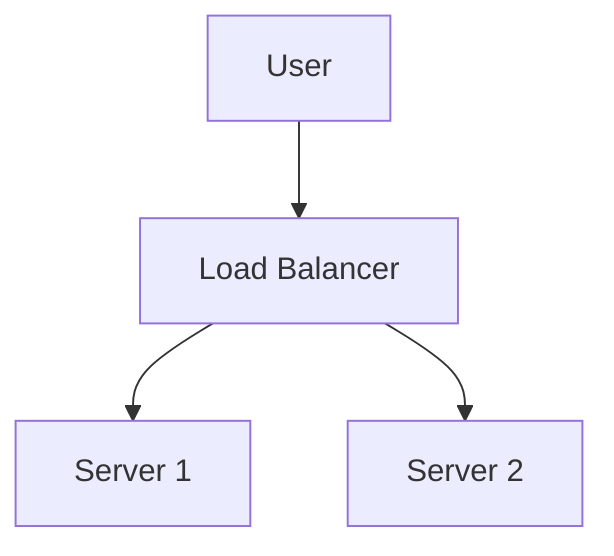
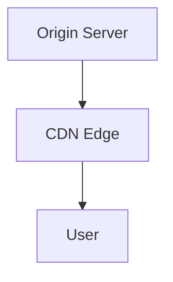

# Functional & Non-Functional Requirements

## Deep Dive: System Design Fundamentals

### 1. Abstractions in Distributed Systems

#### Network Abstraction
- **RPC, REST, gRPC:** Remote calls abstract away network details. REST is stateless and text-based; gRPC is binary and supports streaming.
- **Message Passing:** Used in microservices and distributed systems for decoupling.
#### Consistency Models
- **Strong Consistency:** All clients see the same data at the same time (e.g., RDBMS, Zookeeper).
- **Eventual Consistency:** Updates propagate over time (e.g., DynamoDB, Cassandra).

| Model                | Guarantees                  | Use Case Example         | Trade-off                |
|----------------------|----------------------------|--------------------------|--------------------------|
| Strong               | Always up-to-date          | Banking, Zookeeper       | Lower availability       |
- **Crash:** Node stops responding (most common).
- **Omission:** Messages lost or not sent/received.
- **Byzantine:** Malicious or arbitrary failures (rare, but critical in blockchains).
- **Network Partition:** Network splits into isolated groups.

**Mini Case Study:**
> If a node fails during a write in a distributed DB (e.g., Cassandra), the system may use hinted handoff or write to a quorum of nodes, then reconcile when the failed node recovers. This enables high availability at the cost of possible temporary inconsistency.

#### CAP Theorem
- **Consistency, Availability, Partition Tolerance:** You can only guarantee two in a distributed system.
---

### 2. Non-functional System Characteristics

- **Availability:** Uptime, redundancy, failover, health checks. Example: 99.99% uptime = ~5 min downtime/month.
- **Reliability:** Data durability, error rates, backup/restore, idempotency.
- **Scalability:** Vertical vs horizontal, statelessness, partitioning, bottlenecks.
| Characteristic   | Definition                | Example Metric         | Design Trade-off                |
|------------------|---------------------------|------------------------|---------------------------------|
| Fault Tolerance  | Survives failures         | Recovery time          | Redundancy vs. cost             |
| Durability       | Data persists             | Data loss rate         | Replication vs. write latency   |

**Checklist:**
- [ ] SLAs/SLOs defined for all critical paths
- [ ] Monitoring and alerting in place
- [ ] Regular reliability reviews

---

#### Storage Needs
- Data size, growth rate, retention policy. E.g., 1KB/request × 100 RPS × 86400 = 8.6GB/day.

#### Bandwidth
- Data transfer per request × RPS. E.g., 1KB × 100 RPS = 100KB/s.

**Worked Example:**
> Design for 1M DAU, 100 RPS, 1KB/request → 8.6GB/day. If you want to store 1 year of data: 8.6GB × 365 ≈ 3.1TB.

**Formulas:**
- RPS = users × requests/user/sec
- Storage/day = RPS × size/request × 86400

---
#### DNS
- Name resolution, caching, TTL, root/authoritative/recursive servers.
- **Trade-off:** Lower TTL = fresher data, but more load on DNS servers.

#### Load Balancers
- L4 (TCP/UDP) vs L7 (HTTP/HTTPS), algorithms (round robin, least connections), local/global, health checks.
- **Diagram:**

#### Databases
- SQL vs NoSQL, replication, partitioning, consistency, failover.
- **Trade-off Table:**
| Type   | Pros                | Cons                  | Example Use Case      |
|--------|---------------------|-----------------------|----------------------|
| SQL    | Strong consistency  | Harder to scale       | Banking, inventory   |
| NoSQL  | Scalable, flexible  | Weaker consistency    | Social feeds, logs   |

#### Key-value Stores
- Use cases: session storage, caching, user profiles.
- Replication, versioning, fault tolerance.

#### CDN
- Content caching, edge nodes, cache invalidation, consistency.
- **Diagram:**

#### Distributed Cache
- High-level vs detailed design, eviction, cache coherence.
- **Mini Case Study:** How does Twitter use cache-aside for timelines?

#### Messaging Queues
- Decoupling, durability, at-least-once vs exactly-once, dead-letter queues.

#### Pub-Sub
- Fan-out, ordering, delivery guarantees, scaling.

#### Rate Limiter
- Algorithms: token bucket, leaky bucket, fixed window, distributed rate limiting.

#### Blob Store
- Scalability, storage, performance, S3/GCS design.

#### Distributed Logging
- Log aggregation, durability, search, retention.

#### Sharded Counters
- High-throughput counting, partitioning, aggregation.

#### Sequencer
- Unique ID generation, causality, consistency.

#### Distributed Task Scheduler
- Prioritization, idempotency, queuing, resource optimization.

**Mini Case Study:**
> Twitter shards timelines by user ID to distribute load and enable horizontal scaling. Each shard is responsible for a subset of users, reducing contention and improving performance.

---

This section covers the essential requirements for any robust system, with practical examples and actionable checklists.

## Functional Requirements
Functional requirements define what the system should do. They are derived from user needs, business goals, and domain analysis. For a modern education or learning platform, typical functional requirements include:

### 1. User Authentication
- Secure sign up, login, and password reset.
- Use OAuth2, JWT, and strong password hashing (e.g., bcrypt).
- Multi-factor authentication (MFA) for sensitive actions.
- **Checklist:**
	- [ ] All authentication endpoints use HTTPS
	- [ ] Passwords are never stored in plain text
	- [ ] Rate limiting on login attempts
	- [ ] MFA available for users
	- [ ] Session expiration and refresh tokens implemented
	- [ ] See [OWASP Authentication Cheat Sheet](https://cheatsheetseries.owasp.org/cheatsheets/Authentication_Cheat_Sheet.html)

### 2. User Profile Management
- Update personal info, preferences, and privacy settings.
- Avatar upload, notification preferences, and account deletion.

### 3. Course/Catalog Management
- CRUD operations for courses, search, filtering, and recommendations.
- Faceted search, full-text indexing, and tagging.
- **Checklist:**
	- [ ] Search supports filtering and sorting
	- [ ] Course metadata is normalized
	- [ ] Recommendations are personalized
	- [ ] See [Elasticsearch: The Definitive Guide](https://www.elastic.co/guide/en/elasticsearch/guide/current/index.html)

### 4. Enrollment
- Support both free and paid enrollments, with transactional integrity.
- Waitlists, prerequisites, and batch enrollments.

### 5. Progress Tracking
- Track user progress at module/lesson granularity.
- Store as event logs or summary tables for analytics.

### 6. Quizzes and Assignments
- Auto/manual grading, plagiarism detection, and feedback loops.
- Timed quizzes, randomization, and question banks.
- **Reference:** [Designing Data-Intensive Applications, Ch. 10]

### 7. Discussion Forums
- Threaded discussions per module, moderation tools, and notifications.
- Upvotes, reporting, and sticky threads.

### 8. Payments and Subscriptions
- Integrate with PCI-compliant providers (Stripe, PayPal).
- Handle refunds, chargebacks, and recurring billing.

### 9. Admin Panel
- Role-based access for managing users, content, and analytics.
- Audit logs, bulk actions, and analytics dashboards.

---

## Non-Functional Requirements
Non-functional requirements (NFRs) define system qualities and constraints. They are critical for real-world success and often drive architectural decisions.

### 1. High Availability
- Design for 99.9%+ uptime.
- Use redundancy, failover, and health checks.
- **Checklist:**
	- [ ] Load balancers in front of all critical services
	- [ ] Health checks for all service endpoints
	- [ ] Multi-AZ or multi-region deployment
	- [ ] See [Google SRE Book, Ch. 21]

### 2. Low Latency
- Aim for sub-200ms response times for user actions.
- Use caching, CDNs, and async processing.

### 3. Fault Tolerance
- Graceful degradation, retries, and circuit breakers.
- Chaos engineering to test resilience.
- **Reference:** [Release It! by Michael Nygard]

### 4. Security
- Follow OWASP Top 10, encrypt sensitive data, and use RBAC.
- Regular security audits and penetration testing.
- **Checklist:**
	- [ ] All sensitive data encrypted at rest and in transit
	- [ ] RBAC enforced for all admin actions
	- [ ] Regular vulnerability scans
	- [ ] See [OWASP Top 10](https://owasp.org/www-project-top-ten/)

### 5. Monitoring & Observability
- Collect metrics, logs, and traces.
- Use tools like Prometheus, Grafana, and ELK stack.
- Alerting on SLO/SLA breaches.

### 6. Scalability
- Design to handle 10x user spikes.
- Use horizontal scaling, stateless services, and partitioning.

### 7. Maintainability
- Modular, testable codebase.
- Use CI/CD, code reviews, and automated testing.

---
For more, see [The System Design Primer](https://github.com/donnemartin/system-design-primer) and [Awesome Scalability](https://github.com/binhnguyennus/awesome-scalability).
