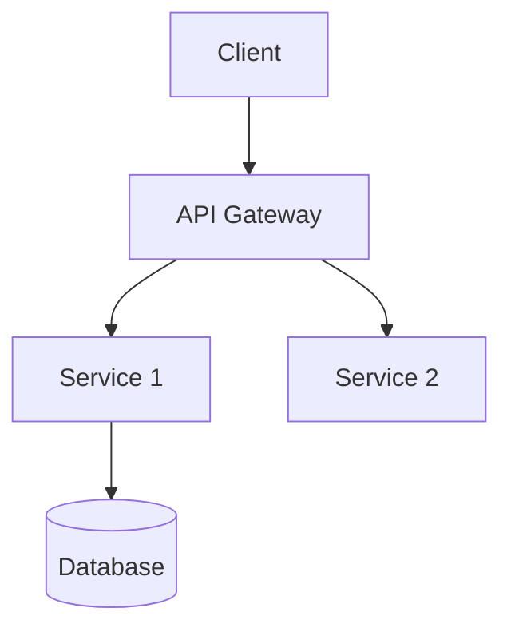

# Mermaid Diagram Template

Use this template to quickly create system diagrams for your documentation.

```mermaid
graph TD
  A[Client] --> B[API Gateway]
  B --> C[Service 1]
  B --> D[Service 2]
  C --> E[(Database)]
```

[Mermaid Live Editor](https://mermaid.live/) for interactive editing.
